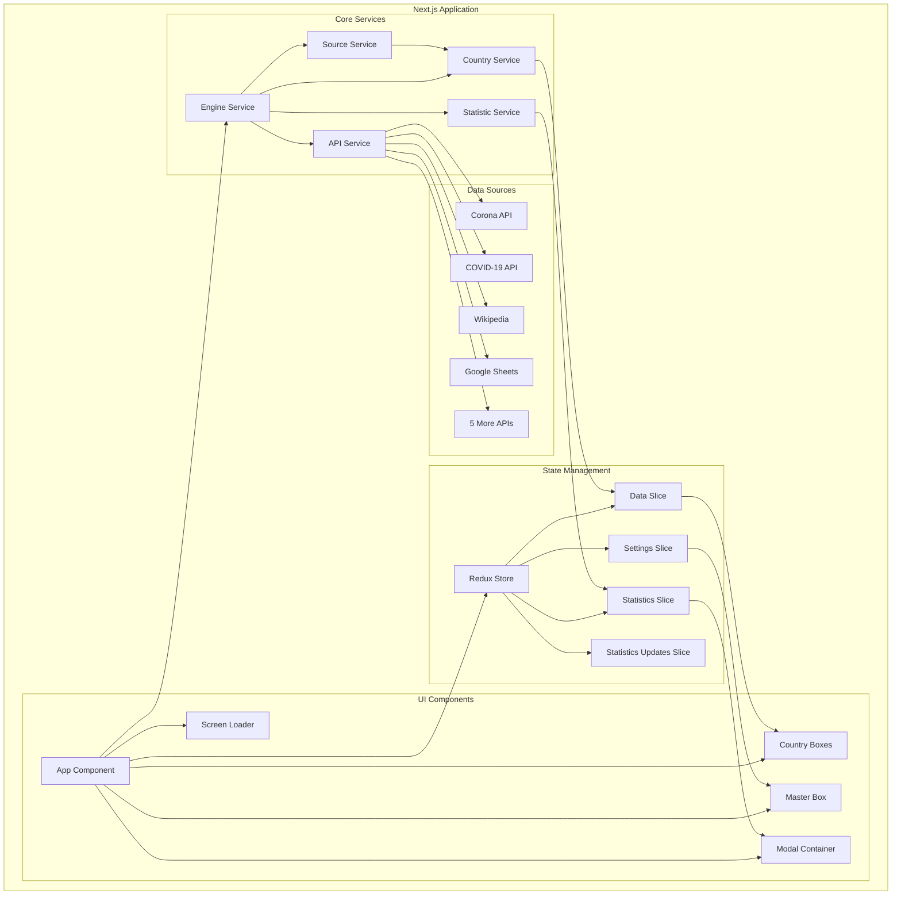
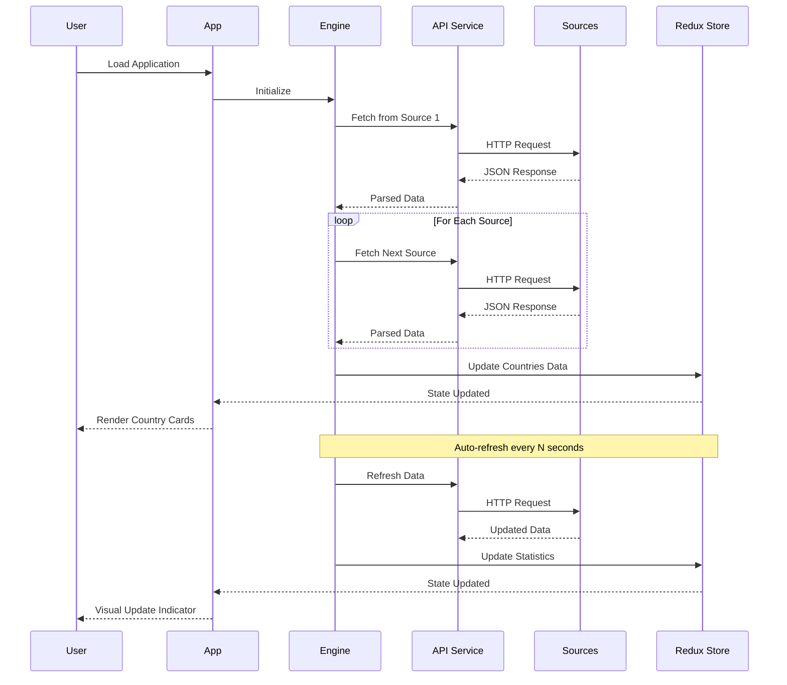
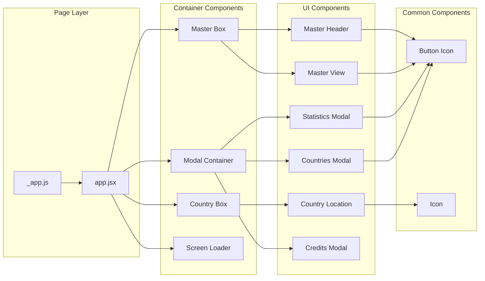

# World COVID-19 Data Dashboard

A comprehensive Next.js application that aggregates and displays real-time COVID-19 statistics from 8 different data sources, providing a unified view of cases, deaths, and recoveries for countries worldwide.

Built in April 2023 with React 18, Next.js 13, and Redux Toolkit, featuring real-time updates, statistics tracking, and an intuitive interface for monitoring global pandemic data.

**Note**: This project was paused and is available for further development.

## Features

- 📊 **Multi-Source Data Aggregation**: Fetches data from 8 different COVID-19 APIs for comprehensive coverage
- 🌍 **Global Coverage**: Displays statistics for 190+ countries and territories
- 🔄 **Real-Time Updates**: Automatic refresh with configurable intervals
- 📈 **Statistics Tracking**: Historical data tracking with update timeline
- 🔍 **Search & Filter**: Find countries quickly with search and filtering
- 📱 **Responsive Design**: Works seamlessly on desktop, tablet, and mobile
- 🎨 **Visual Indicators**: Color-coded cards showing data freshness and updates
- 🗺️ **Geographic Information**: Country flags, locations, and Google Maps integration
- 📊 **Detailed Statistics**: View data by source with timestamps and quality indicators
- 🔄 **Source Recovery**: Automatic retry mechanism for failed API calls
- 🎯 **Sorting Options**: Sort by name, cases, deaths, recoveries, or updates
- 💾 **Development Mode**: Local simulation for testing without API calls

## Architecture

### System Architecture



### Data Flow



### Component Architecture



## Getting Started

### Prerequisites

- Node.js (v14 or higher)
- npm, yarn, or pnpm
- Modern web browser (Chrome, Firefox, Safari, Edge)

### Installation

1. Clone the repository:
```bash
git clone https://github.com/orassayag/world-covid-19-data-nextjs.git
cd world-covid-19-data-nextjs
```

2. Install dependencies:
```bash
npm install
```

3. Configure settings (optional):
   - Open `src/settings/settings.js`
   - Set `ENVIRONMENT_MODE` to `DEVELOPMENT` for local testing or `PRODUCTION` for live data
   - Adjust API URLs and timing settings as needed

4. Start the development server:
```bash
npm run dev
```

5. Open [http://localhost:3000](http://localhost:3000) in your browser

### Configuration

Edit `src/settings/settings.js` to configure:
- **ENVIRONMENT_MODE**: `DEVELOPMENT` (local simulation) or `PRODUCTION` (live data)
- **COMPONENT_MODE**: `APP` (dashboard), `ICONS`, `IMAGES`, or `TEST`
- **API URLs**: Configure the 8 data source endpoints
- **Timing**: Adjust refresh intervals and timeouts
- **Simulation**: Configure local testing parameters

See [INSTRUCTIONS.md](INSTRUCTIONS.md) for detailed configuration options.

## Available Scripts

### Development

```bash
npm run dev
```
Starts the development server with hot-reload and auto-opens the browser.

### Production

```bash
# Build for production
npm run build

# Start production server
npm start
```

### Code Quality

```bash
npm run lint
```
Runs ESLint with Airbnb config, security checks, and style validation.

## Project Structure

```
world-covid-19-data-nextjs/
├── src/
│   ├── components/              # React components
│   │   ├── Boxes/              # Country and master display boxes
│   │   │   ├── Country/        # Country-specific components
│   │   │   └── Master/         # Global statistics components
│   │   ├── Common/             # Shared components (HoursSelect, etc.)
│   │   ├── Modals/             # Modal dialogs
│   │   │   ├── Container/      # Modal container
│   │   │   ├── Countries/      # Countries list modal
│   │   │   ├── Credits/        # Credits modal
│   │   │   └── Statistics/     # Statistics modal
│   │   └── UI/                 # Base UI components
│   ├── core/
│   │   ├── enums/              # Enumerations and constants
│   │   └── models/             # Data models and classes
│   ├── data/                   # Static data (countries, sources, credits)
│   ├── pages/                  # Next.js pages and routing
│   ├── services/               # Business logic and API services
│   │   ├── api.service.js      # HTTP client wrapper
│   │   ├── country.service.js  # Country data processing
│   │   ├── engine.service.js   # Core application engine
│   │   ├── source.service.js   # API source management
│   │   └── ...                 # Additional services
│   ├── settings/               # Application configuration
│   ├── store/                  # Redux store
│   │   ├── slices/             # Redux Toolkit slices
│   │   └── store/              # Store configuration
│   └── utils/                  # Utility functions
│       ├── core.utils.js       # Core utilities
│       ├── logic.utils.js      # Business logic helpers
│       ├── text.utils.js       # Text processing
│       ├── time.utils.js       # Date/time utilities
│       └── validation.utils.js # Validation helpers
├── public/                     # Static assets
│   ├── icons/                  # Icon files
│   └── images/                 # Country flags and images
├── .next/                      # Next.js build output (generated)
├── node_modules/               # Dependencies (generated)
└── package.json                # Project manifest
```

## Data Sources

The application aggregates data from 8 sources:

1. **Corona API** - Real-time COVID-19 statistics
2. **Corona.lmao.ninja** - Global COVID-19 data
3. **COVID-19 API** - Comprehensive pandemic data
4. **Coronavirus-19 API** - Country-specific statistics
5. **Corona Virus Stats** - Detailed case tracking
6. **Google Sheets** - Curated datasets
7. **Wikipedia** - COVID-19 pandemic data
8. **World Population Review** - Population and demographic data

## Key Technologies

- **React 18** - UI library with hooks and concurrent features
- **Next.js 13** - React framework with SSR and routing
- **Redux Toolkit** - State management with slices
- **Axios** - HTTP client for API calls
- **SASS/SCSS** - Stylesheet preprocessor
- **ESLint** - Code quality and security linting

## Development

### Local Testing Mode

Set `ENVIRONMENT_MODE` to `DEVELOPMENT` in settings to:
- Simulate API responses without network calls
- Generate random updates for testing
- Control update frequency and data ranges
- Test UI without relying on external APIs

### Adding New Data Sources

1. Add API URL to `src/settings/settings.js`
2. Create source enum in `src/core/enums/files/sources.enums.js`
3. Add source metadata in `src/data/files/sources.data.js`
4. Implement parser in `src/services/files/source.service.js`
5. Update country matching logic in `src/services/files/country.service.js`

See [CONTRIBUTING.md](CONTRIBUTING.md) for detailed guidelines.

## Contributing

Contributions are welcome! This project accepts:
- Bug reports and fixes
- Feature requests and implementations
- Documentation improvements
- Code quality enhancements
- New data source integrations

Please read [CONTRIBUTING.md](CONTRIBUTING.md) for guidelines on:
- Code style and standards
- Testing requirements
- Pull request process
- Project structure

## Known Issues & Future Development

- Some APIs may become deprecated or unavailable
- Project is currently paused and available for further development
- Future enhancements could include:
  - Vaccination data tracking
  - Historical data visualization with charts
  - Export functionality for statistics
  - More granular geographic filtering
  - WebSocket support for real-time updates

## Author

* **Or Assayag** - *Initial work* - [orassayag](https://github.com/orassayag)
* Or Assayag <orassayag@gmail.com>
* GitHub: https://github.com/orassayag
* StackOverflow: https://stackoverflow.com/users/4442606/or-assayag?tab=profile
* LinkedIn: https://linkedin.com/in/orassayag

## License

This application is licensed under the MIT License - see the [LICENSE](LICENSE) file for details.

## Acknowledgments

- Data provided by multiple COVID-19 tracking APIs
- Country flags and icons from public domain sources
- Built with Next.js and React
- Inspired by the global need for accessible pandemic data
