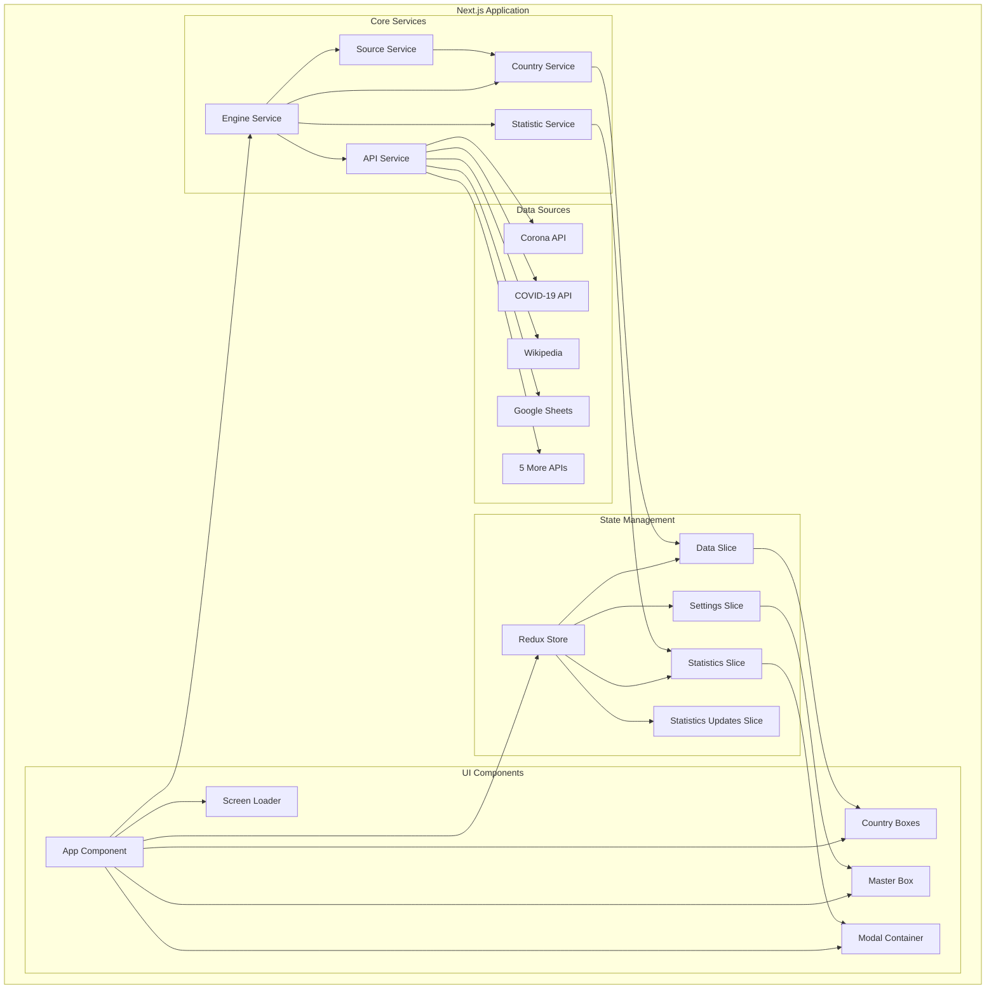
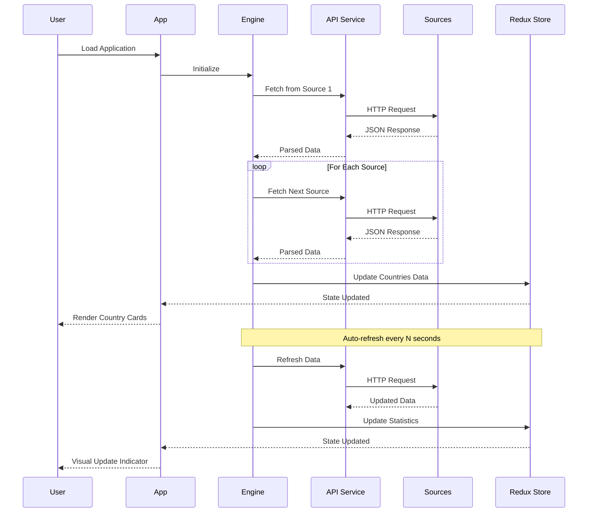
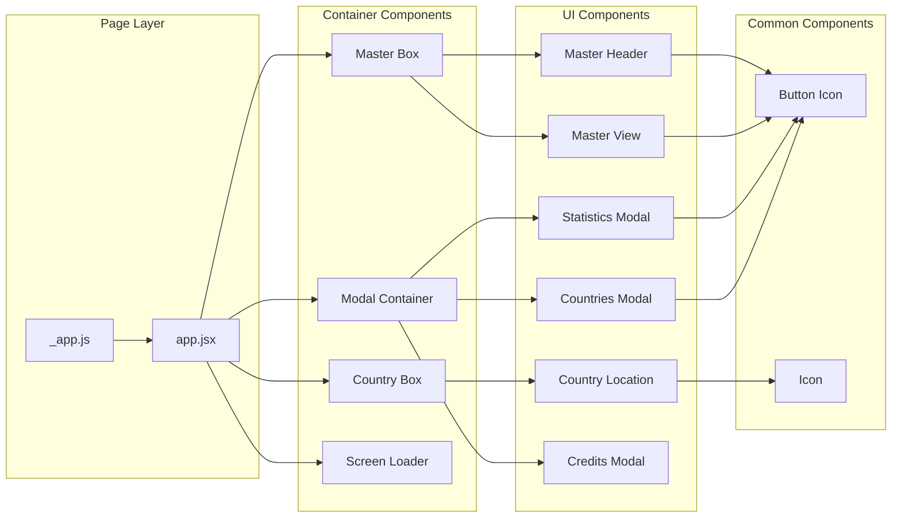

# World Covid 19 Data Nextjs

A comprehensive Next.js application that aggregates and displays real-time COVID-19 statistics from 8 different data sources, providing a unified view of cases, deaths, and recoveries for countries worldwide.

Built in April 2023 with React 18, Next.js 13, and Redux Toolkit, featuring real-time updates, statistics tracking, and an intuitive interface for monitoring global pandemic data.

**Note**: This project was paused and is available for further development.

## Features

### Core Capabilities

- **Multi-Source Data Aggregation**: Fetches data from 8 different COVID-19 APIs for comprehensive coverage
- **Global Coverage**: Displays statistics for 190+ countries and territories
- **Real-Time Updates**: Automatic refresh with configurable intervals
- **Statistics Tracking**: Historical data tracking with update timeline
- **Search & Filter**: Find countries quickly with search and filtering
- **Responsive Design**: Works seamlessly on desktop, tablet, and mobile
- **Visual Indicators**: Color-coded cards showing data freshness and updates
- **Geographic Information**: Country flags, locations, and Google Maps integration
- **Detailed Statistics**: View data by source with timestamps and quality indicators
- **Source Recovery**: Automatic retry mechanism for failed API calls
- **Sorting Options**: Sort by name, cases, deaths, recoveries, or updates
- **Development Mode**: Local simulation for testing without API calls

### Technical Excellence

- **State Management**: Robust Redux Toolkit implementation for global data synchronization
- **Modular Architecture**: Service-oriented design for decoupled business logic and API interactions
- **Data Resilience**: Automatic retry mechanism and multi-source fallback for high availability
- **Type Safety**: Prop-types validation and consistent data modeling across the application
- **Performance**: Optimized rendering with React hooks and Next.js server-side rendering

### Developer Experience

- **Simulation Mode**: Comprehensive local development mode with random data generation for offline testing
- **Environment Flexibility**: Easy switching between development and production environments via settings
- **Structured Logging**: Detailed console logs for data updates, engine state, and service interactions
- **Clean Code**: ESLint integration with Airbnb standards, security checks, and style validation

## Architecture

### Architecture Principles

1. **Service-Oriented Logic**: Business logic is encapsulated in dedicated services (API, Engine, Source, Country).
2. **Unidirectional Data Flow**: State updates flow strictly through Redux actions and slices for predictable state.
3. **Component Modularity**: UI is built from highly reusable atomic components and specialized container components.
4. **Data Normalization**: Source-specific data formats are normalized into a unified country data model.
5. **Resilient Fetching**: Implementation of timeouts, retry counts, and source recovery for all external requests.

### System Architecture


```mermaid
graph TB
    subgraph "Next.js Application"
        A[App Component] --> B[Redux Store]
        A --> C[Engine Service]

        subgraph "State Management"
            B --> D[Data Slice]
            B --> E[Settings Slice]
            B --> F[Statistics Slice]
            B --> G[Statistics Updates Slice]
        end

        subgraph "Core Services"
            C --> H[API Service]
            C --> I[Source Service]
            C --> J[Country Service]
            C --> K[Statistic Service]
        end

        subgraph "Data Sources"
            H --> L[Corona API]
            H --> M[COVID-19 API]
            H --> N[Wikipedia]
            H --> O[Google Sheets]
            H --> P[5 More APIs]
        end

        subgraph "UI Components"
            A --> Q[Country Boxes]
            A --> R[Master Box]
            A --> S[Modal Container]
            A --> T[Screen Loader]
        end
    end

    D --> Q
    E --> R
    F --> S

    I --> J
    J --> D
    K --> F
```

### Data Flow


```mermaid
sequenceDiagram
    participant User
    participant App
    participant Engine
    participant API Service
    participant Sources
    participant Redux Store

    User->>App: Load Application
    App->>Engine: Initialize
    Engine->>API Service: Fetch from Source 1
    API Service->>Sources: HTTP Request
    Sources-->>API Service: JSON Response
    API Service-->>Engine: Parsed Data

    loop For Each Source
        Engine->>API Service: Fetch Next Source
        API Service->>Sources: HTTP Request
        Sources-->>API Service: JSON Response
        API Service-->>Engine: Parsed Data
    end

    Engine->>Redux Store: Update Countries Data
    Redux Store-->>App: State Updated
    App-->>User: Render Country Cards

    Note over Engine,Redux Store: Auto-refresh every N seconds

    Engine->>API Service: Refresh Data
    API Service->>Sources: HTTP Request
    Sources-->>API Service: Updated Data
    Engine->>Redux Store: Update Statistics
    Redux Store-->>App: State Updated
    App-->>User: Visual Update Indicator
```

### Component Architecture


```mermaid
graph LR
    subgraph "Page Layer"
        A[_app.js] --> B[app.jsx]
    end

    subgraph "Container Components"
        B --> C[Master Box]
        B --> D[Country Box]
        B --> E[Modal Container]
        B --> F[Screen Loader]
    end

    subgraph "UI Components"
        C --> G[Master Header]
        C --> H[Master View]
        D --> I[Country Location]
        E --> J[Statistics Modal]
        E --> K[Countries Modal]
        E --> L[Credits Modal]
    end

    subgraph "Common Components"
        G --> M[Button Icon]
        H --> M
        I --> N[Icon]
        J --> M
        K --> M
    end
```

### Directory Structure

```
src/
├── components/          # React components (Boxes, Common, Modals, UI)
├── core/                # Core definitions (Enums, Models)
├── data/                # Static data and metadata (Countries, Sources)
├── pages/               # Next.js pages and routing
├── services/            # Business logic and API interaction services
├── settings/            # Centralized application configuration
├── store/               # Redux state management (Slices, Store)
└── utils/               # Shared utility functions and helpers
```

### Design Patterns

- **Singleton Pattern**: Core services like the Engine and API Service are managed as singletons for consistent state.
- **Observer Pattern**: Redux store implementation allows components to reactively update to data changes.
- **Provider Pattern**: Utilization of Next.js and Redux providers for dependency injection across the component tree.
- **Facade Pattern**: Services provide a simplified interface to complex data parsing and API interaction logic.

## Getting Started

### Prerequisites

- Node.js (v14 or higher)
- npm, yarn, or pnpm
- Modern web browser (Chrome, Firefox, Safari, Edge)

### Installation

1. Clone the repository:

```bash
git clone https://github.com/orassayag/world-covid-19-data-nextjs.git
cd world-covid-19-data-nextjs
```

2. Install dependencies:

```bash
npm install
```

3. Configure settings (optional):
   - Open `src/settings/settings.js`
   - Set `ENVIRONMENT_MODE` to `DEVELOPMENT` for local testing or `PRODUCTION` for live data
   - Adjust API URLs and timing settings as needed

4. Start the development server:

```bash
npm run dev
```

5. Open [http://localhost:3000](http://localhost:3000) in your browser

### Configuration

Edit `src/settings/settings.js` to configure:

- **ENVIRONMENT_MODE**: `DEVELOPMENT` (local simulation) or `PRODUCTION` (live data)
- **COMPONENT_MODE**: `APP` (dashboard), `ICONS`, `IMAGES`, or `TEST`
- **API URLs**: Configure the 8 data source endpoints
- **Timing**: Adjust refresh intervals and timeouts
- **Simulation**: Configure local testing parameters

See [INSTRUCTIONS.md](INSTRUCTIONS.md) for detailed configuration options.

## Usage

The application automatically starts fetching and aggregating COVID-19 data upon launch.

- **Monitor Global Data**: Use the Master Box at the top to see global totals and application status.
- **Browse Countries**: Scroll through country cards or use the search bar to find specific locations.
- **View Details**: Click on any country card to open the statistics modal for source-specific data.
- **Customize View**: Use the sorting and filtering options to organize data by your preferences.
- **Toggle View Modes**: Switch between grid and list views using the layout toggle button.

## Available Scripts

### Development

```bash
npm run dev
```

Starts the development server with hot-reload and auto-opens the browser.

### Production

```bash
# Build for production
npm run build

# Start production server
npm start
```

### Code Quality

```bash
npm run lint
```

Runs ESLint with Airbnb config, security checks, and style validation.

## Project Structure

```
world-covid-19-data-nextjs/
├── src/
│   ├── components/              # React components
│   │   ├── Boxes/              # Country and master display boxes
│   │   │   ├── Country/        # Country-specific components
│   │   │   └── Master/         # Global statistics components
│   │   ├── Common/             # Shared components (HoursSelect, etc.)
│   │   ├── Modals/             # Modal dialogs
│   │   │   ├── Container/      # Modal container
│   │   │   ├── Countries/      # Countries list modal
│   │   │   ├── Credits/        # Credits modal
│   │   │   └── Statistics/     # Statistics modal
│   │   └── UI/                 # Base UI components
│   ├── core/
│   │   ├── enums/              # Enumerations and constants
│   │   └── models/             # Data models and classes
│   ├── data/                   # Static data (countries, sources, credits)
│   ├── pages/                  # Next.js pages and routing
│   ├── services/               # Business logic and API services
│   │   ├── api.service.js      # HTTP client wrapper
│   │   ├── country.service.js  # Country data processing
│   │   ├── engine.service.js   # Core application engine
│   │   ├── source.service.js   # API source management
│   │   └── ...                 # Additional services
│   ├── settings/               # Application configuration
│   ├── store/                  # Redux store
│   │   ├── slices/             # Redux Toolkit slices
│   │   └── store/              # Store configuration
│   └── utils/                  # Utility functions
│       ├── core.utils.js       # Core utilities
│       ├── logic.utils.js      # Business logic helpers
│       ├── text.utils.js       # Text processing
│       ├── time.utils.js       # Date/time utilities
│       └── validation.utils.js # Validation helpers
├── public/                     # Static assets
│   ├── icons/                  # Icon files
│   └── images/                 # Country flags and images
├── .next/                      # Next.js build output (generated)
├── node_modules/               # Dependencies (generated)
└── package.json                # Project manifest
```

## Data Sources

The application aggregates data from 8 sources:

1. **Corona API** - Real-time COVID-19 statistics
2. **Corona.lmao.ninja** - Global COVID-19 data
3. **COVID-19 API** - Comprehensive pandemic data
4. **Coronavirus-19 API** - Country-specific statistics
5. **Corona Virus Stats** - Detailed case tracking
6. **Google Sheets** - Curated datasets
7. **Wikipedia** - COVID-19 pandemic data
8. **World Population Review** - Population and demographic data

## Key Technologies

- **React 18** - UI library with hooks and concurrent features
- **Next.js 13** - React framework with SSR and routing
- **Redux Toolkit** - State management with slices
- **Axios** - HTTP client for API calls
- **SASS/SCSS** - Stylesheet preprocessor
- **ESLint** - Code quality and security linting

## Development

### Local Testing Mode

Set `ENVIRONMENT_MODE` to `DEVELOPMENT` in settings to:

- Simulate API responses without network calls
- Generate random updates for testing
- Control update frequency and data ranges
- Test UI without relying on external APIs

## Best Practices

- **API Rate Limiting**: Always respect source rate limits by configuring appropriate fetch delays in settings.
- **Error Boundaries**: The application implements graceful handling of API failures to ensure UI stability.
- **Responsive Design**: Ensure the dashboard remains functional and legible across all device screen sizes.
- **Data Freshness**: Monitor the color-coded indicators to verify the reliability and age of displayed statistics.

### Adding New Data Sources

1. Add API URL to `src/settings/settings.js`
2. Create source enum in `src/core/enums/files/sources.enums.js`
3. Add source metadata in `src/data/files/sources.data.js`
4. Implement parser in `src/services/files/source.service.js`
5. Update country matching logic in `src/services/files/country.service.js`

See [CONTRIBUTING.md](CONTRIBUTING.md) for detailed guidelines.

## Contributing

Contributions are welcome! This project accepts:

- Bug reports and fixes
- Feature requests and implementations
- Documentation improvements
- Code quality enhancements
- New data source integrations

Please read [CONTRIBUTING.md](CONTRIBUTING.md) for guidelines on:

- Code style and standards
- Testing requirements
- Pull request process
- Project structure

## Known Issues & Future Development

- Some APIs may become deprecated or unavailable
- Project is currently paused and available for further development
- Future enhancements could include:
  - Vaccination data tracking
  - Historical data visualization with charts
  - Export functionality for statistics
  - More granular geographic filtering
  - WebSocket support for real-time updates

## Support

For questions, issues, or contributions:

- **GitHub Issues**: [https://github.com/orassayag/world-covid-19-data-nextjs/issues](https://github.com/orassayag/world-covid-19-data-nextjs/issues)
- **Email**: orassayag@gmail.com

## Author

- **Or Assayag** - _Initial work_ - [orassayag](https://github.com/orassayag)
- Or Assayag <orassayag@gmail.com>
- GitHub: https://github.com/orassayag
- StackOverflow: https://stackoverflow.com/users/4442606/or-assayag?tab=profile
- LinkedIn: https://linkedin.com/in/orassayag

## License

This application has an MIT license - see the [LICENSE](LICENSE) file for details.

## Acknowledgments

- Built for educational and research purposes
- Respects robots.txt and implements rate limiting
- Uses user-agent rotation to avoid detection
- Implements polite crawling practices
